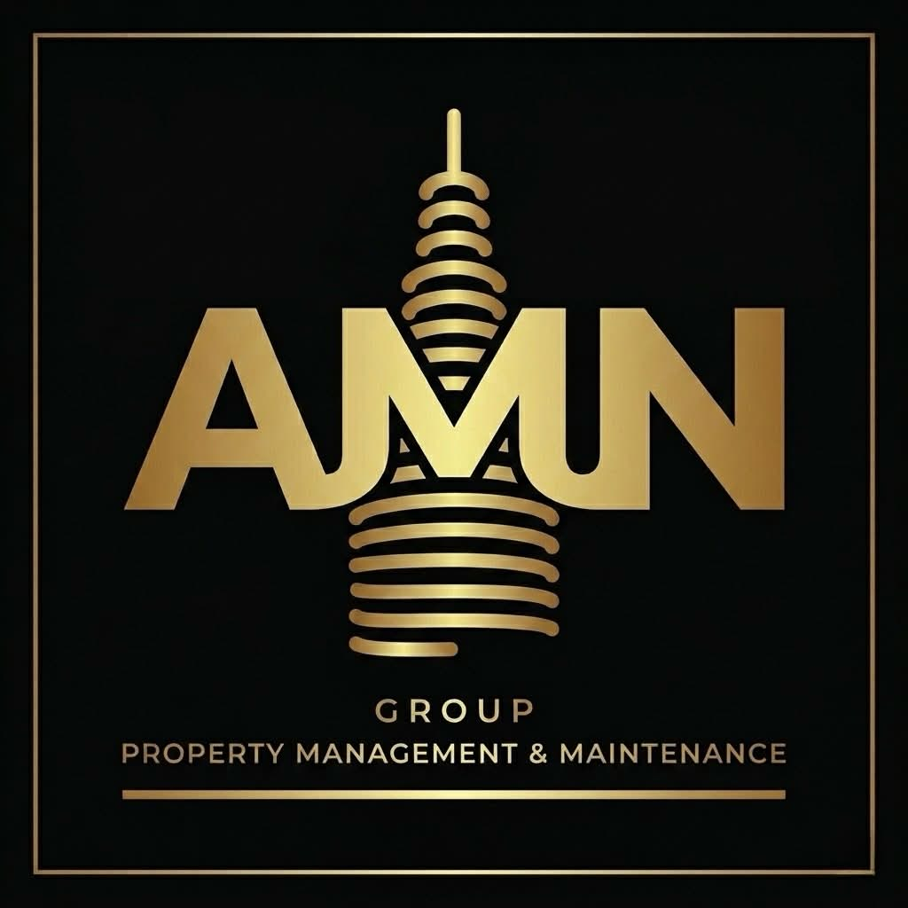

[![LinkedIn][linkedin-shield]][linkedin-url]

 

  

<h3 align="center">AMN Group</h3>

  

    Corporate website developed for AMN Group to showcase services, strengthen digital presence, and support client engagement.
     
    Built with a focus on clean UI, responsiveness, and scalability.
  

---

### Built With

**Frontend**
- HTML5
- CSS3
- JavaScript

**Form Handling**
- Includes Formspree API for contact form functionality

(<a href="#readme-top">back to top</a>)

---

## Features

- Clean and responsive company website design
- Service and project showcase
- Contact and inquiry functionality

(<a href="#readme-top">back to top</a>)

---

## Roadmap

- [ ] Optimize performance and SEO
- [ ] Enhance privacy policy and analyze data analytics for insights and predictions
- [ ] Buy a domain
- [ ] Deploy to cloud infrastructure

(<a href="#readme-top">back to top</a>)

---

## Contact

AMN Group  
Email: info@amngroupinc.com  

Project Link:  
https://github.com/mariam-merza/amn-group-website

(<a href="#readme-top">back to top</a>)

---

[linkedin-shield]: https://img.shields.io/badge/-LinkedIn-black.svg?style=for-the-badge&logo=linkedin&colorB=555
[linkedin-url]: https://www.linkedin.com/in/marymerza/
